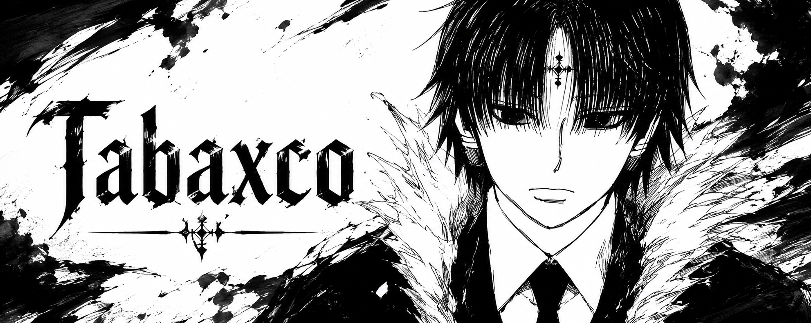

  

  
  

## About Me

I am a **Back-End Developer** in the making. 
I enjoy building robust logic and exploring how systems communicate under the hood.
My curiosity is what pulls me deeper into systems, APIs and the logic that holds it all together.

## Tech Stack

  

## GitHub Stats

  
  

